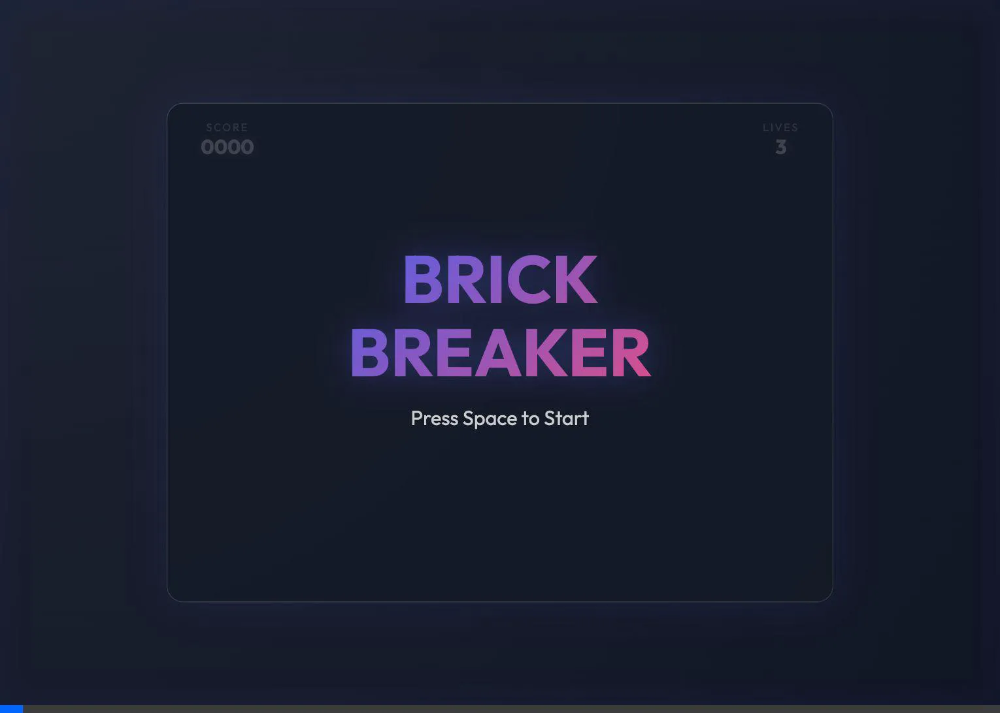

# Antigravity Playground - Premium Brick Breaker

A modern, fast-paced Brick Breaker game built with Vanilla JavaScript and HTML5 Canvas, featuring a premium glassmorphism design.

## 🎮 How to Play
- **Start**: Press `Space`
- **Move Paddle**: Use `Left Arrow` and `Right Arrow` keys
- **Goal**: Break all bricks without losing all your lives!

## 🎥 Gameplay Preview

## ✨ Features
- **Glassmorphism UI**: Stylish visual effects with gradients and blur.
- **Dynamic Physics**: Fast-paced ball movement and paddle deflection.
- **Score System**: Track your score and remaining lives.
- **Responsive**: Centered layout optimized for desktop play.

## 🚀 Play Now
[Play on GitHub Pages](https://oronaminc.github.io/Antigravity_Playground/)

## 🛠️ Development
Built with HTML, CSS, and modular JavaScript.
